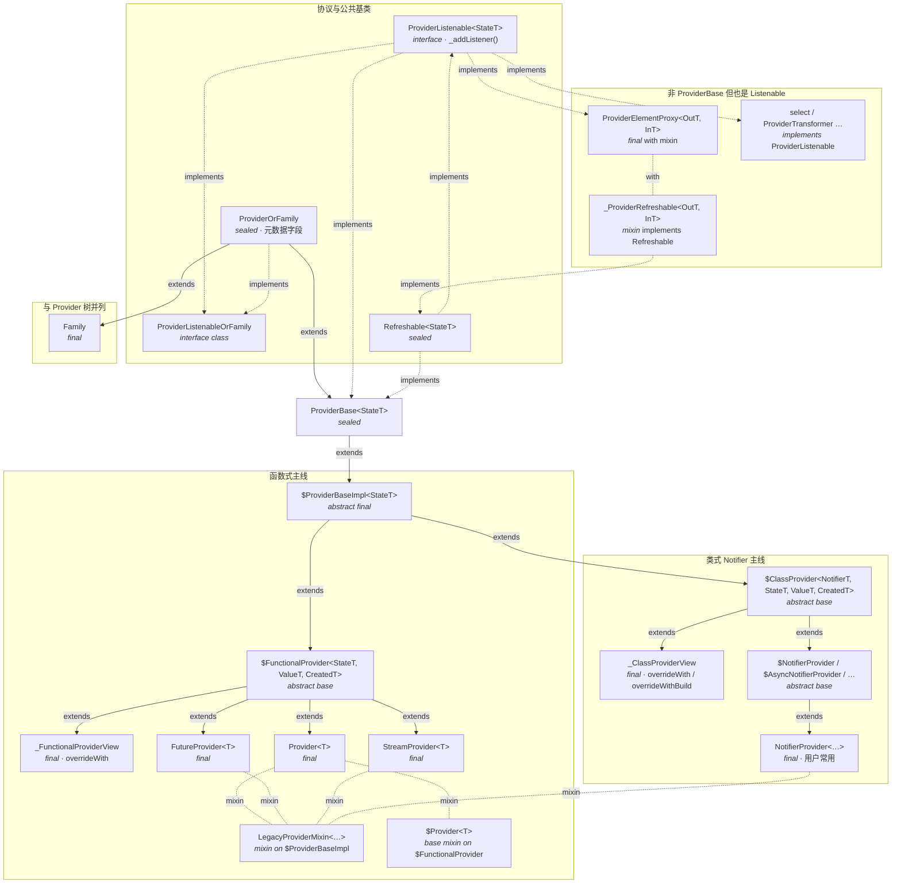

[← 返回状态管理目录](README.md)

`Riverpod` 架构设计方面非常优秀，整体是一种 **面向协议（POP）** 的思路：不管是什么类型的 `Provider`，`watch` / `read` 面对的都是 **`ProviderListenable`**。若不熟悉这种设计，读源码会以类型跳转很碎。
`Riverpod` 里重要概念用 **`extends` / `with` / `implements`** 拆得很细；下面先给 **「Provider 声明侧」** 一张总图（仅 `package:riverpod`，不含 `ProviderElement` / `ProviderSubscription`）。

`Riverpod` 中包含以下几个重要概念：
- Provider
- ProviderElement
- ProviderSubscription

---

## 图解：Provider 侧的继承 / 混入 / 协议

下图中的 **`$` 前缀** 表示生成器 / 内部 API 使用的类型名（源码里字面如此）。**实线箭头：extends；虚线箭头：implements；点划线：仅 mixin 约束（on）**。



**读图提示**

- **`ProviderBase`** 同时 **`implements ProviderListenable` 与 `Refreshable`**（`Refreshable` 本身也是 **`implements ProviderListenable`**，因此 `ref.refresh` 可用的表达式与 `watch` 用的表达式在类型上分叉）。
- **`$FunctionalProvider` 与 `$ClassProvider`** 都从 **`$ProviderBaseImpl`** 分叉：前者对应 **`create(Ref)` 回调**；后者对应 **`Notifier` 实例 + build**。
- **`LegacyProviderMixin`** 挂在多个具体 `Provider` / `NotifierProvider` 上，为非 generator 路径提供 `debugGetCreateSourceHash` 等兼容行为（**`mixin on $ProviderBaseImpl`**）。
- **`ProviderElementProxy`（如 `provider.future` / `provider.notifier`）** 不是 **`ProviderBase`**，通过 **`with _ProviderRefreshable`** 接入 **`Refreshable` → `ProviderListenable`**，并自己实现 **`_addListener`**。

---

## 一、Provider：从协议到具体类

### 1. 最上层：谁算「可被监听」

```text
ProviderListenableOrFamily (interface) 没有任何内容
    ↑ implements
ProviderOrFamily (sealed)     // family / 公共元数据：name, dependencies, isAutoDispose, retry …
    ↑ extends
ProviderBase<StateT> (sealed) // 一切「正式 provider」的基类
    implements ProviderListenable<StateT>,
               Refreshable<StateT>,  // 与 ref.refresh 等有关
               _ProviderOverride
```

- **`ProviderListenable<StateT>`**（`foundation.dart`）：对外消费协议，核心是内部方法 **`_addListener(...)`**（由各类 listenable 自己实现）。
- **`ProviderBase<StateT>`**（`provider.dart`）：所有 **Provider 类型** 的抽象根；持有 **`$createElement`（Element 工厂）**、`argument` / `from`（family）等。
- **`Refreshable<StateT>`**：与「可刷新」表达式有关；`ref.watch(provider.future)` 一类会落到 `Refreshable` 子类型上。

### 2. 实现层：`$ProviderBaseImpl` → 函数式 Provider 骨架

```text
ProviderBase<StateT>
    ↑
$ProviderBaseImpl<StateT> (abstract final)
```

`$ProviderBaseImpl` 负责 **`_addListener` 的默认实现**（例如非 weak 时先 `flush()` 被监听方等），是绝大多数「真·挂在 Container 上」的 provider 的共同父类。

### 3. 函数式 Provider 三元组：`$FunctionalProvider`

```text
$ProviderBaseImpl<StateT>
    ↑
$FunctionalProvider<StateT, ValueT, CreatedT> (abstract base)
```

三个类型参数的大致含义（读源码时用来对齐 `watch` 到的类型 vs `create` 返回类型）：

| 参数 | 含义 |
|------|------|
| **StateT** | Element 里 **`value` / 对外监听状态** 的类型（例如同步 Provider 就是 `T`；`FutureProvider` 则是 `AsyncValue<T>`）。 |
| **ValueT** | 异步场景里「**数据**」那一层（例如 `FutureProvider<T>` 里对应 **`T`**，而 StateT 是 `AsyncValue<T>`）。 |
| **CreatedT** | **`create(Ref)`（或生成器里的等价回调）返回类型**（例如 `FutureOr<T>`、`Stream<T>`）。 |

`_FunctionalProviderView` **继承** 同一个 `$FunctionalProvider`，用于 **`overrideWith`**：只换掉 `create`，**`$createElement` 仍委托给 inner**，但把 element 上的 **`provider` 指向 view**，从而 override 生效。

### 4. 用户可见的具体 `Provider` 类（举例）

```text
$FunctionalProvider<ValueT, ValueT, ValueT>
    ↑ extends
Provider<ValueT>
    with $Provider<ValueT>,           // 空 mixin，给代码生成/扩展点用
         LegacyProviderMixin<ValueT>  // 非 generator 的 debug hash 等
```

```text
$FunctionalProvider<AsyncValue<T>, T, FutureOr<T>>
    ↑ extends
FutureProvider<T>
    with $FutureModifier<T>, $FutureProvider<T>, …
```

```text
$FunctionalProvider<AsyncValue<T>, T, Stream<T>>
    ↑ extends
StreamProvider<T>
    with $StreamProvider<T>, …
```

**Notifier / AsyncNotifier** 走 **`$ClassProvider` + `$ClassProviderElement`** 另一条线（基于「类 + `AnyNotifier`」，不是 `$FunctionalProvider`），但仍 **`extends ProviderBase`** 并实现 **`$createElement`**。

---

## 二、`ProviderElement` 侧：运行时节点

### 1. 根类

```text
ProviderElement<StateT, ValueT> (abstract)
    implements Node
```

- 与 **`Provider` 上的 `StateT` / `ValueT` 泛型成对出现**：管理 **`value`**、`Ref`、依赖订阅、**`dependents` / `weakDependents`**、`flush` / `invalidateSelf` / `dispose` 等**所有运行时行为**。
- **`origin`**：pointer 上的「原始」provider；**`provider`**：可能已被 override 替换的实现（子类里多为 **可变字段**，便于 `_FunctionalProviderView` 覆盖）。

### 2. 函数式 Provider 的 Element 公共基类

```text
ProviderElement<StateT, ValueT>
    ↑
$FunctionalProviderElement<StateT, ValueT, CreatedT> (abstract)
    with ElementWithFuture   // 与 Future/Stream 的 future 通道、异步生命周期相关
```

同步 **`Provider`** 的 element：

```text
$FunctionalProviderElement<ValueT, ValueT, ValueT>
    ↑
$ProviderElement<ValueT>
```

### 3. Mixin：`ElementWithFuture`

**`mixin ElementWithFuture<StateT, ValueT> on ProviderElement<StateT, ValueT>`**

- 用在 **`$FunctionalProviderElement`** 与 **`$ClassProviderElement`** 上，给 **`FutureProvider` / `StreamProvider` / Notifier 异步族** 共用：例如 **`futureNotifier`、complete `Completer`、异步 dispose** 等。
- 同步 `Provider` 的 `$ProviderElement` 虽然也从带 **`ElementWithFuture`** 的 `$FunctionalProviderElement` 来，但同步场景下这套异步设施几乎不参与业务路径。

### 4. Notifier 系 Element

```text
ProviderElement<StateT, ValueT>
    with ElementWithFuture
    ↑
$ClassProviderElement<NotifierT, StateT, ValueT, CreatedT> (abstract)
```

内部再通过 **`classListenable`（`$Observable<NotifierT>`）** 持有 Notifier 实例，**`create($Ref)`** 里负责 **构造 Notifier、挂 `_element`、调 `runBuild()`** 等。

### 5. 其它 Element 变体

- **`overrideWithValue`** 等会用 **`ProviderElement` 的子类**（例如 `override_with_value.dart` 里专用 element），仍为 **`ProviderElement<StateT, ValueT>`** 这一棵树上的分支。

---

## 三、`ProviderSubscription` 侧：监听句柄

### 1. 对外类型与实现根类

```text
ProviderSubscription<OutT> (sealed)   // 用户能拿到的抽象
    ↑ extends
ProviderSubscriptionImpl<OutT> (sealed)
    with _OnPauseMixin                  // pause / resume / deactivate 计数
```

- **`ProviderSubscription`**：只暴露 **`closed` / `weak` / `isPaused` / `read` / `pause` / `resume` / `close`**。
- **`read()`** 默认走 **`readSafe()`**（内部：`mayNeedDispose` → `flush` → `_callRead()`）。

### 2. 两种具体实现类（继承分支）

**（1）直接监听 `ProviderBase`：**

```text
ProviderSubscriptionImpl<StateT>
    ↑
ProviderProviderSubscription<StateT>
```

- 持有真正的 **`ProviderElement<StateT, Object?> listenedElement`**。
- **`_callRead()`** → **`_listenedElement.readSelf()`**。
- **`weak` 为字段**，构造时确定。

**（2）监听「派生 listenable」（`select`、`ProviderTransformer`、`ProviderElementProxy` / `$LazyProxyListenable` 等）：**

```text
ProviderSubscriptionImpl<OutT>
    ↑
ExternalProviderSubscription<InT, OutT>
```

- 内层 **`ProviderSubscription<InT> _innerSubscription`**（通常是 **`ProviderProviderSubscription`**）。
- **`_listenedElement`** 来自 **inner**，保证 pause/close 时仍挂在**同一个真实 Element** 上。
- **`weak`** 从 **inner** 透传；**`_callRead()`** 走构造时传入的 **`read` 闭包**（例如从 `select` 的 transformer 或 proxy 的 `requireResult` 读出）。

**父子订阅**：**`ExternalProviderSubscription`** 可对 inner 调用 **`_attach(parent)`**，形成「包装链」，用于 pause/close 联动。

---

## 四、不是 `ProviderBase` 的 `ProviderListenable`

这些类 **implements `ProviderListenable`**（或间接实现），但 **不继承 `ProviderBase`**：

| 类型 | 作用 |
|------|------|
| **`_ProviderSelector` / `select` 相关** | 在 **源 Provider** 上挂 transformer，`_addListener` 返回 **`ExternalProviderSubscription`**。 |
| **`SyncProviderTransformerMixin` + `ProviderTransformer`** | 通用转换状态机；内部同样 **`ExternalProviderSubscription`**。 |
| **`ProviderElementProxy` / `$LazyProxyListenable`** | 例如 **`provider.future`**：先 `listen(真实 provider)`，再挂 **`$Observable` 上的 lens**（见 `proxy_provider_listenable.dart`）。 |

因此：**「监听」统一走 `ProviderListenable._addListener`，「是否有一个 ProviderElement」取决于链条最里层是不是指向某个 `$ProviderBaseImpl`。**

---

## 五、三者如何串起来（记忆链）

1. **`ProviderBase`（具体类如 `Provider<T>`）** 实现 **`$createElement`** → 容器为每个 pointer 创建一个 **`ProviderElement<…>`** 子类实例。  
2. **`Ref.watch/listen`** 在 **某个 `ProviderListenable`** 上调用 **`_addListener`**：  
   - 直连 **`ProviderBase`** → **`ProviderProviderSubscription`**；  
   - 派生 listenable → **`ExternalProviderSubscription`** 包一层或多层。  
3. **Element** 维护 **谁依赖我（dependents / weakDependents）** 与 **我依赖谁（subscriptions）**，**`flush` / scheduler / autoDispose** 都发生在这棵树与订阅表上。

---

## 附录：文中仍建议顺带掌握的概念

- **Provider**（用户概念）
- **ProviderElement**（运行时节点）
- **ProviderSubscription**（监听句柄）

---

*以上为阅读 `packages/riverpod` 源码时的继承/拆分笔记，版本迭代时以当前仓库为准。*
